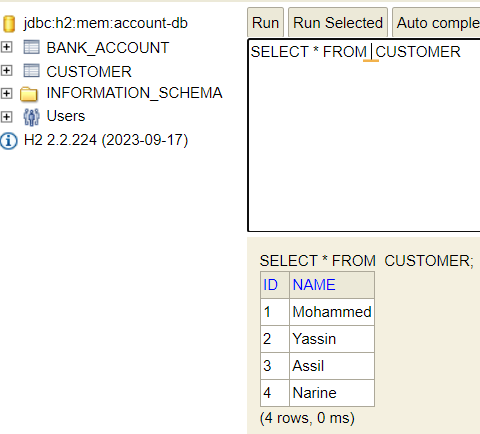

<!DOCTYPE html>
<html lang="en">
<head>
  <meta charset="UTF-8">
  <meta name="viewport" content="width=device-width, initial-scale=1.0">
  <title>Bank Account Microservice</title>
</head>
<body>
  <h1>Bank Account Microservice</h1>
  

    This project demonstrates the implementation of a microservice for managing bank accounts using Spring Boot. It includes features such as account creation, updating, deletion, RESTful APIs, H2 database integration, and data projections.
  

<h2>📌 Table of Contents</h2>
  <ul>
    <li><a href="#overview">Overview</a></li>
    <li><a href="#features">Features</a></li>
    <li><a href="#technologies-used">Technologies Used</a></li>
    <li><a href="#setup-and-configuration">Setup and Configuration</a></li>
    <li><a href="#project-structure">Project Structure</a></li>
    <li><a href="#endpoints">Endpoints</a></li>
    <li><a href="#testing">Testing</a></li>
    <li><a href="#projections">Projections</a></li>
    <li><a href="#screenshots">Screenshots</a></li>
    <li><a href="#author">Author</a></li>
  </ul>

<h2 id="overview">Overview</h2>
  

    This project was developed as part of the <strong>Systèmes Distribués</strong> module under the supervision of <strong>Mohamed Youssfi</strong>. It showcases the creation of a Spring Boot microservice with Spring Data JPA, H2 database, and RESTful APIs.
  

<h2 id="features">Features</h2>
  <ul>
    <li>Manage bank accounts (create, update, delete, and retrieve).</li>
    <li>Generate random accounts using a <code>CommandLineRunner</code>.</li>
    <li>CRUD operations with RESTful endpoints.</li>
    <li>In-memory H2 database integration.</li>
    <li>Swagger UI for API documentation.</li>
    <li>Custom projections for selective data queries.</li>
  </ul>

<h2 id="technologies-used">Technologies Used</h2>
  <ul>
    <li>Java 21</li>
    <li>Spring Boot 3.4.1</li>
    <li>Spring Data JPA</li>
    <li>H2 Database</li>
    <li>Springdoc OpenAPI</li>
    <li>Lombok</li>
    <li>Maven</li>
  </ul>

<h2 id="setup-and-configuration">Setup and Configuration</h2>
  <ol>
    <li>Clone the Repository:
      <pre>
git clone https://github.com/your-username/bank-account-microservice.git
cd bank-account-microservice
      </pre>
    </li>
    <li>Install Dependencies:
      <pre>mvn clean install</pre>
    </li>
    <li>Run the Application:
      <pre>mvn spring-boot:run</pre>
    </li>
    <li>Access the H2 Console:
      <ul>
        <li>URL: <code>http://localhost:8081/h2-console</code></li>
        <li>JDBC URL: <code>jdbc:h2:mem:account-db</code></li>
      </ul>
    </li>
  </ol>

<h2 id="project-structure">Project Structure</h2>
  <pre>
project-folder/
├── README.md
├── src/
│   ├── main/
│   │   ├── java/com/example/bankacountsevice/
│   │   │   ├── entities/
│   │   │   ├── repository/
│   │   │   ├── web/
│   │   │   └── BankAcountSeviceApplication.java
│   ├── test/
│   └── ...
├── pom.xml
└── screenshots/
  </pre>

<h2 id="endpoints">Endpoints</h2>
  
Base URL: <code>http://localhost:8081/api</code>

  <table border="1">
    <thead>
      <tr>
        <th>Method</th>
        <th>Endpoint</th>
        <th>Description</th>
      </tr>
    </thead>
    <tbody>
      <tr>
        <td>GET</td>
        <td>/bankAccounts</td>
        <td>Get all accounts</td>
      </tr>
      <tr>
        <td>GET</td>
        <td>/bankAccounts/{id}</td>
        <td>Get account by ID</td>
      </tr>
      <tr>
        <td>POST</td>
        <td>/bankAccounts</td>
        <td>Create a new account</td>
      </tr>
      <tr>
        <td>PUT</td>
        <td>/bankAccounts/{id}</td>
        <td>Update an account</td>
      </tr>
      <tr>
        <td>DELETE</td>
        <td>/bankAccounts/{id}</td>
        <td>Delete an account</td>
      </tr>
    </tbody>
  </table>

<h2 id="testing">Testing</h2>
  
Use Postman to test the API endpoints or the Swagger UI available at <code>http://localhost:8081/swagger-ui/index.html</code>.

<h2 id="projections">Projections</h2>
  

    Projections allow for custom data queries, such as fetching specific fields only. Example:
  

  <pre>
@Projection(types = BankAccount.class, name = "p1")
public interface AccountProjection {
  String getId();
  AccountType getType();
  Double getBalance();
}
  </pre>
  
Request example: <code>GET /bankAccounts?projection=p1</code>

<h2 id="author">Author</h2>
  
<strong>Salma Chafiq</strong> Encadré par Mohamed Youssfi

</body>
</html>
